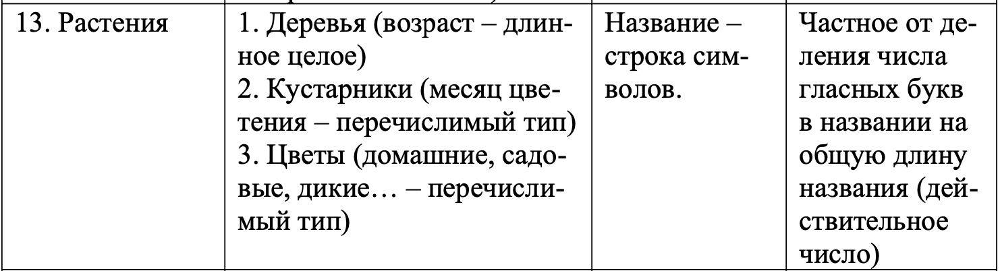

Пояснительная записка 
* Описание задания:  
Вариант 69  
  Начальное условие задачи:  
    
  Обработка данных в контейнере:  
       
    
* Tребуемые метрики, определяющие характеристики программы, для различных тестовых прогонов.   
Тесты с  вводом данных:

  Номер теста | Время
  ------------ | -------------
  01 | 0,175ms
  02 | 0,2ms
  03 | 0,343ms
  04 | 0,334ms
  05 | 0,496ms

  
Тесты с рандомной генерацией: 

Номер теста | Время | N
------------ | ------------- | -------------
01 | 0,215ms | 1
02 | 0,243ms | 10
03 | 2,604ms | 100
04 | 239,265ms | 1000
05 | 25425,339ms | 10000
 

* Данные, демонстрирующие сравнение с характеристиками ранее разработанных программ:  
Это первая программа. 
 
* Основные характеристики программы:   
1) Число заголовочных файлов: 6
2) Число модулей реализации: 6 + main.c
3) Размер Unix Executable: 26 КБ
4) Размер исходных кодов 22,2 КБ

  
  